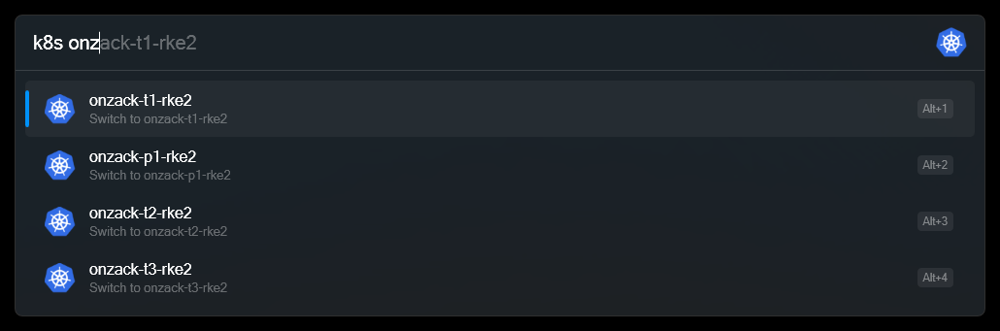

# Kubernetes Context Switcher - Flow Launcher Plugin

A Flow Launcher plugin that allows you to quickly switch between Kubernetes contexts using a simple search interface.



## Features

- View current Kubernetes context
- List all available contexts
- Search and filter contexts by name
- Quick context switching with visual feedback
- Automatic kubectl detection in common installation paths

## Installation

### Prerequisites

1. **Flow Launcher** - Download and install from [https://www.flowlauncher.com/](https://www.flowlauncher.com/)
2. **kubectl** - Make sure kubectl is installed and available in your PATH
3. **.NET 7.0 Runtime** - Required to run the plugin

### Using Flow Launcher Plugin Manager (Recommended)

1. Open Flow Launcher
2. Type `pm` to open the Plugin Manager
3. Search for "Kubernetes Context Switcher"
4. Click Install

### Manual Installation

1. Clone or download this repository
2. Build the project:
   ```powershell
   cd KubernetesContextSwitcher
   dotnet build -c Release
   ```
3. Run `.\deploy-plugin.ps1` to copy the entire `KubernetesContextSwitcher` folder to your Flow Launcher plugins directory:
   - **Default location**: `%APPDATA%\FlowLauncher\Plugins\`
4. Restart Flow Launcher

## Usage

### Basic Usage

1. Open Flow Launcher (default: `Alt + Space`)
2. Type `k8s` to activate the plugin
3. You'll see:
   - Your current Kubernetes context at the top
   - All available contexts below
4. Use arrow keys to navigate and `Enter` to switch to a context

### Search and Filter

1. Type `k8s` followed by a search term
2. The plugin will filter contexts that match your search
3. Example: `k8s prod` will show only contexts containing "prod"

### Keyboard Shortcuts

- `Enter` - Switch to the selected context
- `Tab` - Navigate through results

## Configuration

The plugin automatically detects kubectl in the following locations:
- System PATH
- Docker Desktop installation
- WinGet installation

If kubectl is installed in a different location, you can modify the `_kubectlPath` variable in `Main.cs`.

## Troubleshooting

### Plugin Not Working

1. **Check kubectl installation**:
   ```powershell
   kubectl version --client
   ```

2. **Check Flow Launcher logs**:
   - Open Flow Launcher
   - Type `log` to view logs
   - Look for any error messages related to the plugin

### No Contexts Found

1. **Check your kubeconfig**:
   ```powershell
   kubectl config view
   ```

2. **Verify contexts exist**:
   ```powershell
   kubectl config get-contexts
   ```

3. **Check kubeconfig location**:
   ```powershell
   echo $env:KUBECONFIG
   ```

### Permission Issues

If you encounter permission issues:
1. Run Flow Launcher as Administrator
2. Check that your kubeconfig file has proper permissions
3. Verify kubectl has access to your kubeconfig

## Development

### Building from Source

1. Clone the repository
2. Install .NET 7.0 SDK
3. Build the project:
   ```powershell
   dotnet build -c Release
   ```

### Project Structure

```
Flow.Launcher.Plugin.KubernetesContextSwitcher/
├── Main.cs                            # Main plugin logic
├── plugin.json                        # Plugin manifest
├── KubernetesContextSwitcher.csproj   # Project file
├── Images/                            # Plugin icons
│   ├── k8s.png                        # Kubernetes icon
│   └── error.png                      # Error icon
└── README.md                          # This file
```

### Contributing

1. Fork the repository
2. Create a feature branch
3. Make your changes
4. Test thoroughly
5. Submit a pull request

## License

This project is licensed under the MIT License - see the LICENSE file for details.

## Acknowledgments

- [Flow Launcher](https://www.flowlauncher.com/) - The amazing launcher framework
- [Kubernetes](https://kubernetes.io/) - The container orchestration platform
- [Flow.Launcher.Plugin](https://github.com/Flow-Launcher/Flow.Launcher.PluginsManifest) - The plugin SDK

## Support

If you encounter any issues or have questions:
1. Check the troubleshooting section above
2. Search existing issues on GitHub
3. Create a new issue with detailed information about your problem

## Changelog

### Version 1.0.1
- Initial release
- Basic context switching functionality
- Search and filter capabilities
- Automatic kubectl detection
- Visual feedback for context switching 